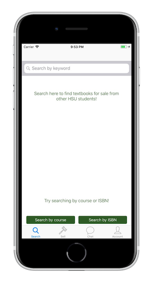
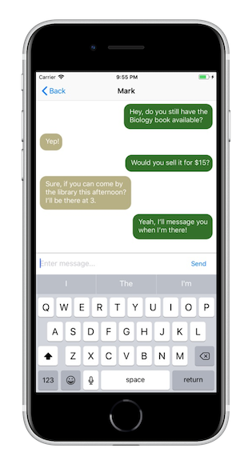
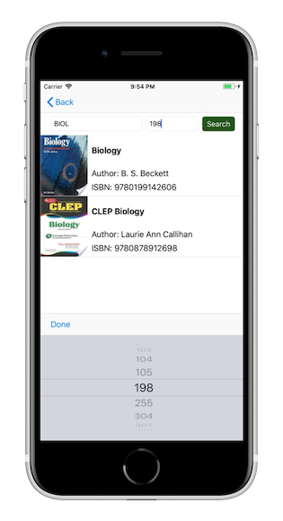

## iOS app for students at Humboldt State University to buy/sell each other’s used textbooks. 
### Application was written in Swift and included:
* Firebase Authentication
* Firebase Realtime-Database (JSON)
* Google Books API
* Realtime messaging with push notifications
* Barcode Scanner using Apple Vision framework

  

This app is no longer on the app store primarily because it needs to be available on Android as well. Otherwise the user base is limited, which makes a customer-to-customer model more difficult. Because my primary goal was to learn about iOS development, there are currently no plans to develop an Android or web version.
